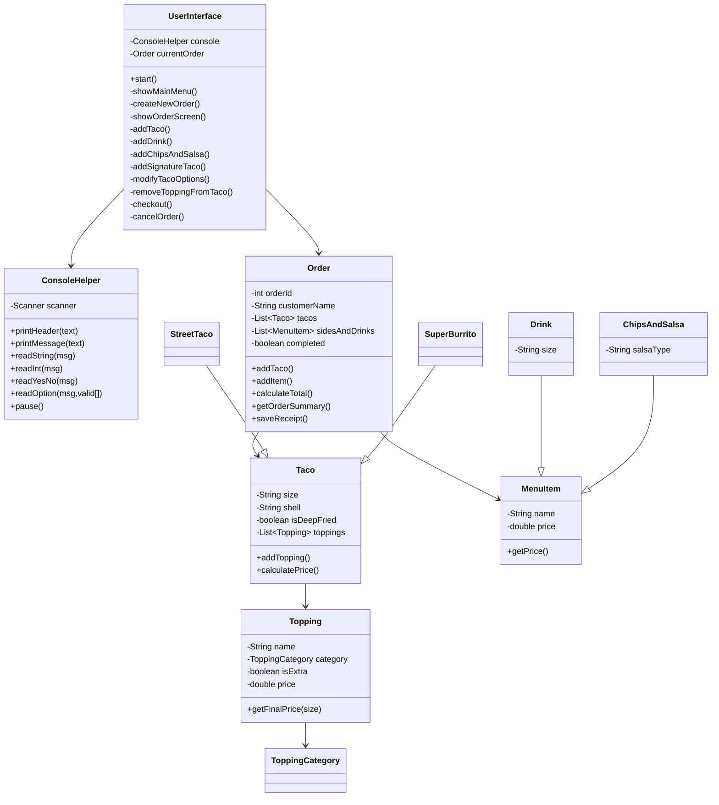

# 🌮 Let's Taco 'Bout It! 🌮
### (Taco Restaurant Management System Application)
-------------------------
This is a object-oriented console-based restaurant management system built in Java! This program allows users to build taco orders, add sides and drinks, and receive receipt files.

This system demonstrates strong Object-Oriented Programing design using:
- Encapsulation
- Inheritance
- Polymorphism
- Abstraction

Every part of the order process — tacos, drinks, toppings, sides, and signature items. All are represented in its own class, making the system easy to read and maintain.

-------------------------
## ⭐️ Design and Thought Process

Before writing code, I identified the main components based on the Capstone Project Description. Such as the Classes, Packages and the organization. I also noted that the system needed a way to interact with users, manage pricing, and generate receipts.

Pre-code Ideas:

An order contains multiple tacos or other menu items.

Separate classes manage the Menu(s), provide order, and console interaction.

File I/O is used to generate receipt files for each completed order.

-------------------------
## ⭐️ Features

- Its Purpose: Create and manage customer orders.
- Add fully customized Tacos:
  - Choose taco size
  - Choose shell type
  - Add meats, cheeses, veggies, sauces
  - Add extra premium toppings
  - Option to deep-fry
- Add drinks (small/medium/large)
- Add chips & salsa (choose salsa type)
- Signature Tacos (Bonus Feature)
  - Street Taco
  - Super Burrito
  - Customizable (add/remove toppings)
- Input validation for all choices
- Auto-generated receipts saved as timestamped `.txt` files
- Organized folder structure using Object-Oriented Programing best practices
  
-------------------------
## ⭐️ Project Structure

-------------------------
## ⭐️ Class Breakdown & Responsibilities
#### Below is a high-level overview of each Class in the project and its purpose within the system.

### ConsoleHelper
Utility class that handles all user input and output:
- Prints headers and messages
- Reads String, int, and Yes/No input
- Validates options (using readOption)
- Ensures the UI stays clean and consistent

### UserInterface
The core controller for the entire application:
- Displays all screens (Home, Order Screen, Taco Builder, etc.)
- Manages the flow of a customer’s order
- Coordinates input validation
- Handles checkout, order cancellation, and calling saveReceipt()

### Order
Represents the full customer order:
- Stores tacos, drinks, and sides
- Calculates totals
- Generates a formatted summary
- Saves the receipt file to /receipts/ with a timestamp

### Taco
Represents a customizable taco:
- Tracks size, shell type, deep-fried option
- Holds a list of toppings
- Calculates price based on size + toppings + extra charges

### Topping
Represents an individual topping chosen by the user:
- Tracks category (meat/cheese/veggie/sauce/etc.)
- Applies “extra” pricing rules
- Works with taco price calculation

### MenuItem
Base class for drinks and chips & salsa:
- Stores name and price
- Used for polymorphic storage in Order

### Drink
Represents a drink:
- Inherits MenuItem
- Stores drink size + flavor

### ChipsAndSalsa
Represents a chips & salsa item:
- Inherits MenuItem
- Stores salsa type

## Signature Taco Classes
#### Optional “bonus feature” templates that inherit from Taco.

### StreetTaco
Preset 3-taco plate with:
- Corn tortillas
- Carne asada
- Onion & cilantro
- Salsa verde
- Lime wedges
Customer can still modify toppings afterward.

### SuperBurrito
Preset burrito with:
- Flour tortilla
- Carnitas
- Cheddar
- Pico de gallo
- Lettuce
- Tomato
- Birria dipped
Customizable like any other taco.
-------------------------
## ⭐️ Class Diagram (UML)

-------------------------
## ⭐️ Screens & User Flow

### MAIN MENU
1. New Order
0. Exit
   
Enter your choice: 

Enter Customer Name:

-------------------------
### ORDER SCREEN
1. Add Taco
2. Add Drink
3. Add Chips & Salsa
4. Checkout
5. Add Signature Taco
0. Cancel Order
   
Choose an option:

-------------------------
### SIGNATURE TACOS
1. Street Taco
2. Super Burrito
0. Back
   
Choose a signature taco:

-------------------------
## ⭐️ Receipts Folder
When an order is checked out:

A folder named receipts/ is automatically created (if it doesn't exist)

Each receipt contains:

- Customer name

- Full taco details

- Drinks & sides

- Total price

- Completion status

-------------------------

# ⭐️ Taco Class Outline/Framework

## Taco Class Pricing Coding Plan

## Order Class Outline/Framework

## ConsoleHelper Outline/Framework

## UserInterface Class Outline/Framework

## StreetTaco Class Outline/Framework

## SuperBurrito Class Outline/Framework

-------------------------

## How to Run
Clone the repository from GitHub.
Open the project in IntelliJ.
Run Main.java to start the application.

-------------------------
